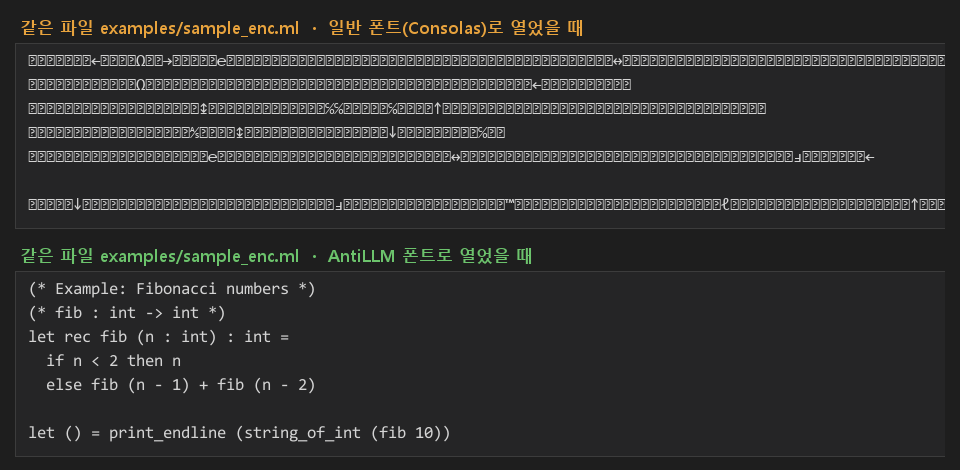

# AntiLLM

사람 눈에는 평범한 코드로 보이지만, LLM이 파일을 읽으면 의미 없는 문자열이 되는 텍스트를 만드는 실험입니다.
파일에 저장된 유니코드 값과 폰트가 화면에 그려 주는 모양이 서로 달라도 된다는 점을 이용합니다.

2026년 봄 학기 프로그래밍 언어(CSE307) 과목 프로젝트로 만들었습니다.



## 아이디어

목표는 Claude Code 같은 AI 도구가 터미널에서 과제 파일을 읽고 대신 풀지 못하게 하는 것이었습니다.

새로운 언어나 문법을 만들어도 규칙이 있는 한 LLM은 금방 따라 배웁니다.
그래서 언어가 아니라 **사람과 AI가 텍스트를 인식하는 방식의 차이**에 집중했습니다.

- LLM은 파일에 저장된 **코드포인트**를 읽습니다.
- 사람은 폰트가 그린 **글자 모양**을 봅니다.

코드포인트는 알아볼 수 없게 바꾸고, 전용 폰트가 원래 글자 모양을 그려 주게 하면 두 쪽이 보는 내용이 달라집니다.

## 동작 원리

### 1. 치환: 한 글자를 9가지 코드포인트로

출력 가능한 ASCII 문자(32-126)를 유니코드 사용자 정의 영역(PUA, U+E000부터)으로 옮깁니다.

```
코드포인트 = 0xE000 + (문자 코드 - 32) × 9 + (순번 mod 9)
```

순번은 텍스트 안에서 글자의 위치입니다. 그래서 같은 `e`라도 위치에 따라 U+E26D부터 U+E275까지 9가지 코드포인트 중 하나가 됩니다.
같은 단어가 나와도 매번 다른 문자열이 되므로 반복 패턴이 드러나지 않습니다.

```
원문     l       e       t
암호문   U+E2AC  U+E26E  U+E2F6
```

개행이나 한글처럼 ASCII 범위 밖의 문자는 바꾸지 않습니다.

### 2. 노이즈: 보이지 않는 문자 끼워 넣기

치환한 글자 뒤마다 무작위 기호를 1-3개 끼워 넣습니다.
기호는 문자형 기호(U+2100-214E)와 화살표(U+2190-21FE) 190개 중에서 고릅니다.
텍스트 길이가 원래의 약 3배가 되고, LLM이 보는 문자열에는 의미 있는 토큰이 거의 남지 않습니다.

### 3. 폰트: 원래 글자 모양 입히기

FontForge로 원본 폰트를 바탕으로 새 폰트를 만듭니다.

- PUA 코드포인트 855개(95글자 × 9)에 원래 글자의 모양을 복사합니다.
- 노이즈 기호 190개는 빈 모양으로 바꾸고 폭을 거의 0으로 만듭니다.

이 폰트로 암호문 파일을 열면 노이즈는 사라지고 원래 코드만 보입니다(위 그림 아래쪽).

## 파일 구성

| 파일 | 설명 |
| --- | --- |
| `build_font.py` | 원본 폰트로 `AntiLLM.ttf`를 만드는 FontForge 스크립트 |
| `endec.py` | 암호화/복호화 로직과 대화형 도구 |
| `encrypt_files.py` | 여러 파일을 한 번에 암호화 |
| `viewer.html` | 암호문을 캔버스에 그리고 복사와 우클릭을 막는 보안 뷰어 시안 |
| `examples/` | 예제 코드(`sample.ml`)와 암호화본(`sample_enc.ml`) |

## 사용법

### 1. 폰트 만들기

[FontForge](https://fontforge.org/)를 설치합니다. 스크립트는 FontForge에 포함된 `ffpython`으로 실행해야 합니다.

원본 폰트는 직접 준비합니다. 아무 `.ttf`나 쓸 수 있고, 코드를 보여 줄 거라면 고정폭 폰트가 좋습니다.

```
"C:\Program Files\FontForgeBuilds\bin\ffpython.exe" build_font.py <원본 폰트.ttf> [출력 파일.ttf]
```

출력 파일을 지정하지 않으면 `AntiLLM.ttf`가 생성됩니다. 폰트를 설치한 뒤 에디터 폰트를 출력된 폰트 이름(`AntiLLM_V4_숫자`)으로 바꿉니다.
폰트 이름 끝에 생성 시각이 붙으므로, 다시 만들어도 Windows에 캐시된 예전 폰트와 섞이지 않습니다.

### 2. 텍스트 암호화

```
python encrypt_files.py hw1.md problem1.ml
```

같은 폴더에 `hw1_enc.md`, `problem1_enc.ml`이 생깁니다.

대화형으로 쓰려면 `python endec.py`를 실행합니다. 1(암호화) 또는 2(복호화)를 고르고, 텍스트를 붙여 넣은 뒤 Ctrl+Z(Windows) 또는 Ctrl+D(macOS, Linux)를 누르면 됩니다.

### 3. 보안 뷰어

`viewer.html`과 `AntiLLM.ttf`를 같은 폴더에 두고 로컬 서버로 엽니다.

```
python -m http.server
```

브라우저에서 `http://localhost:8000/viewer.html`을 열고 "과제 불러오기"를 누릅니다.
파일을 더블클릭해서 열면 브라우저에 따라 폰트를 불러오지 못할 수 있습니다.

## 실험 결과 (2026년 4월)

과목 과제 1의 문제 파일들을 암호화해서 시험했습니다.

- **Claude Code**: 암호화된 파일을 주고 해독을 요청했으나 분석에 실패했습니다. 원래 목표였던 "터미널에서 AI로 과제 풀기 막기"는 달성했습니다.
- **웹 Claude**: 원본과 암호화본을 함께 올리고 해독을 요청하자, 보이지 않는 문자 때문에 프롬프트 인젝션 위험이 있다고 판단해 거절했습니다.
- **화면 캡처**: 폰트를 적용한 화면을 캡처해서 보내자 별 어려움 없이 문제를 풀었습니다.

## 한계

- **캡처와 OCR에는 대응할 수 없습니다.** 이미지를 읽는 모델은 코드포인트가 아니라 화면의 모양을 봅니다. 사람이 읽을 수 있어야 한다는 목표와 근본적으로 부딪히는 부분입니다.
- **키가 비밀 역할을 하지 않습니다.** 키워드(`ASDFGHJKL`)는 길이(9)만 쓰이고 글자 내용은 쓰이지 않습니다. 또 (코드포인트 - 0xE000)를 9로 나눈 몫만으로 원래 글자가 나오기 때문에 키 없이도 복호화됩니다. 방식을 아는 사람에게는 단순 치환과 다르지 않습니다. 보호 효과는 방식이 알려지지 않았다는 점과, LLM이 이 문자열을 의미 있는 토큰으로 묶지 못한다는 점에서 나옵니다.
- **폰트를 분석하면 풀립니다.** `.ttf`를 폰트 에디터로 열어 글리프 모양을 대조하면 매핑표를 복원할 수 있습니다.
- **폭이 거의 없는 문자를 다루는 방식이 프로그램마다 다릅니다.** 일부 브라우저나 에디터는 이런 문자를 지우거나 줄바꿈을 망가뜨릴 수 있습니다. 프로젝트 당시에는 MS Word와 VS Code에서 확인했습니다.
- **ASCII가 아닌 문자는 암호화되지 않습니다.** 한글 주석 같은 내용은 그대로 드러납니다.

## 개발 과정

커밋 기록이 실제 버전 순서를 따릅니다. 커밋의 작성 날짜(author date)는 원래 파일을 수정한 시각입니다.

- **v1 (4/9)**: U+0500 부근으로 오프셋만큼 옮기는 단순 치환. 한 글자가 코드포인트 하나에 대응해서 빈도 분석에 약했습니다.
- **v2 (4/9)**: PUA로 옮기고 위치에 따라 9가지 코드포인트를 돌려 쓰는 방식.
- **v3 (4/9)**: 투명 노이즈 삽입과 복호화 기능 추가. 앞의 실험 결과는 이 무렵의 코드로 얻었습니다.
- **4/20**: 코드용 고정폭 폰트(Consolas) 기반 생성기, 캔버스 보안 뷰어 추가.
- **정리 (2026-09-24)**: 공개용으로 구조를 정리하면서 두 가지 버그를 고쳤습니다.
  - 암호화할 때와 복호화할 때 순번을 세는 방식이 달라, 여러 줄짜리 텍스트를 복호화하면 글자가 한 칸씩 밀렸습니다. 순번 없이 몫만으로 복호화하도록 바꿨습니다.
  - FontForge는 고정폭 폰트를 TTF로 내보낼 때 폭 0인 글리프까지 고정폭 값으로 덮어씁니다. 그래서 Consolas 기반 폰트에서는 노이즈가 공백으로 보였습니다. 노이즈 폭을 1(1/2048 em)로 두어 해결했습니다.

## 폰트 라이선스

생성되는 폰트는 원본 폰트의 글리프를 복사한 파생 폰트입니다. 그래서 이 저장소에는 폰트 파일을 넣지 않았습니다.
생성한 폰트를 배포하려면 원본 폰트의 라이선스가 수정과 재배포를 허용해야 합니다(예: SIL Open Font License 폰트).
Consolas, Arial 같은 Windows 기본 폰트는 재배포할 수 없습니다.
